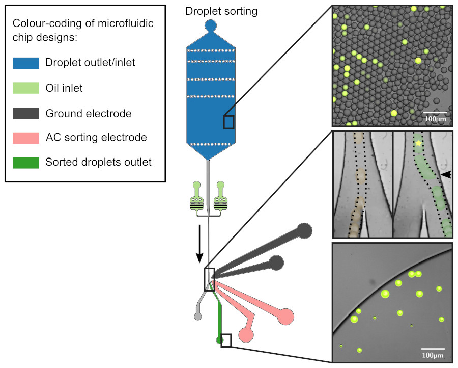
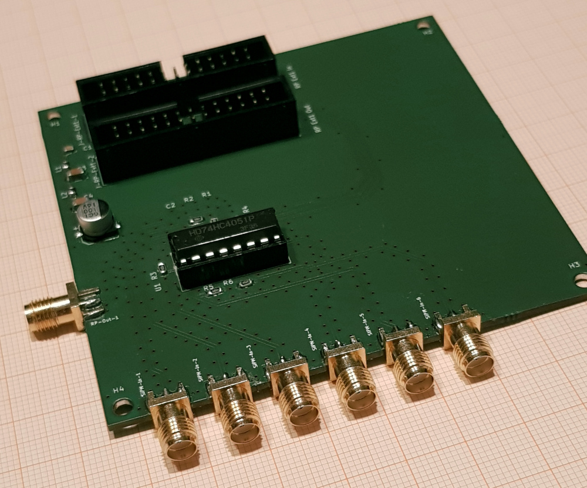
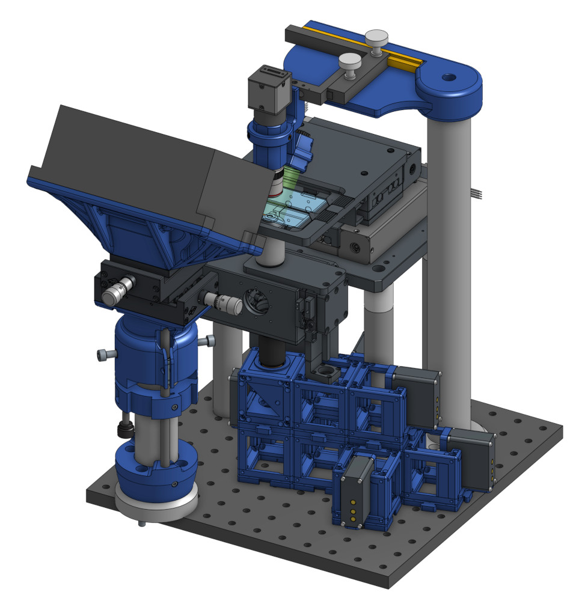
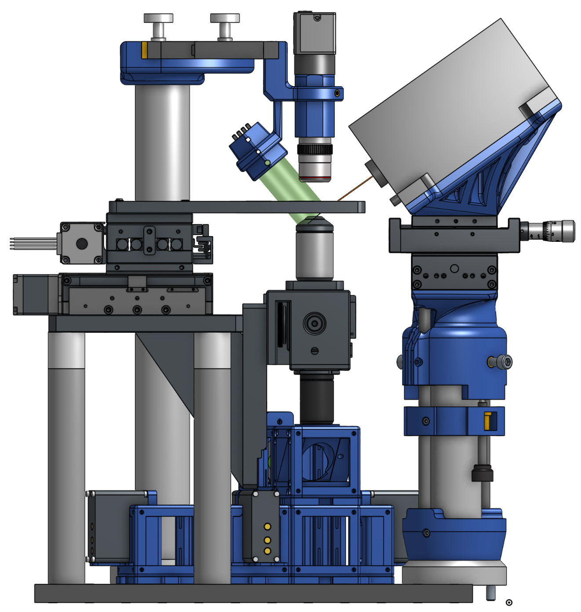
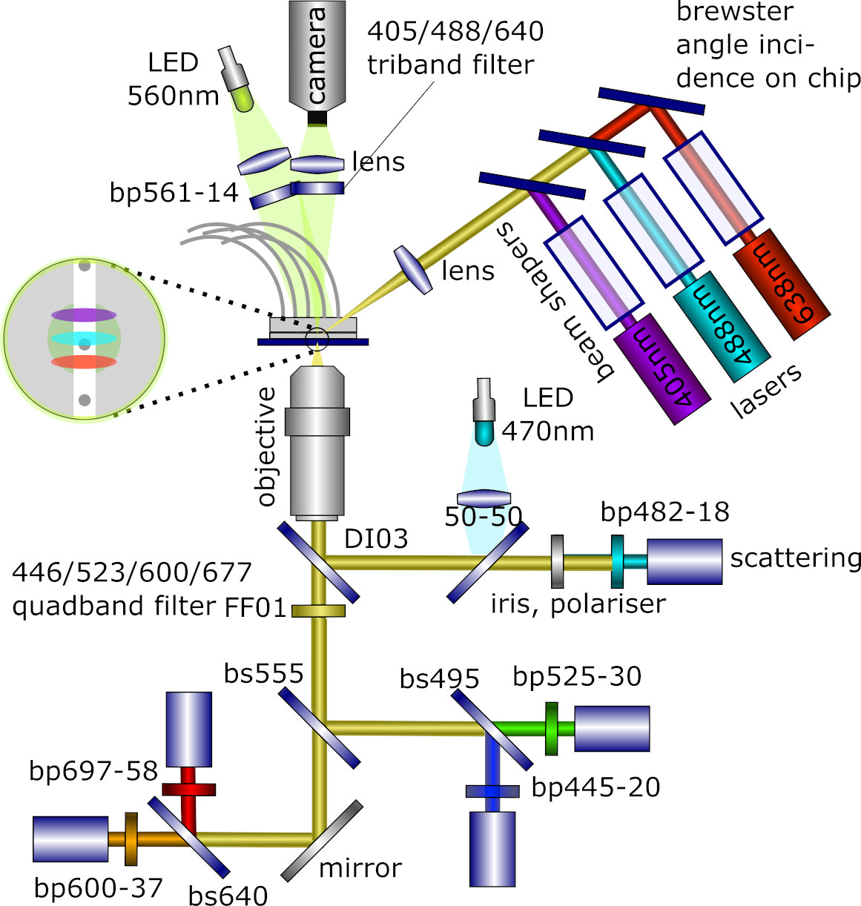
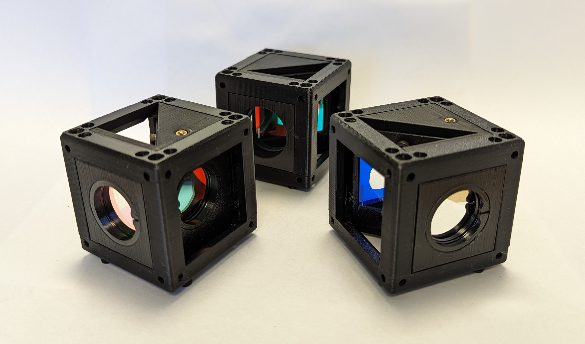
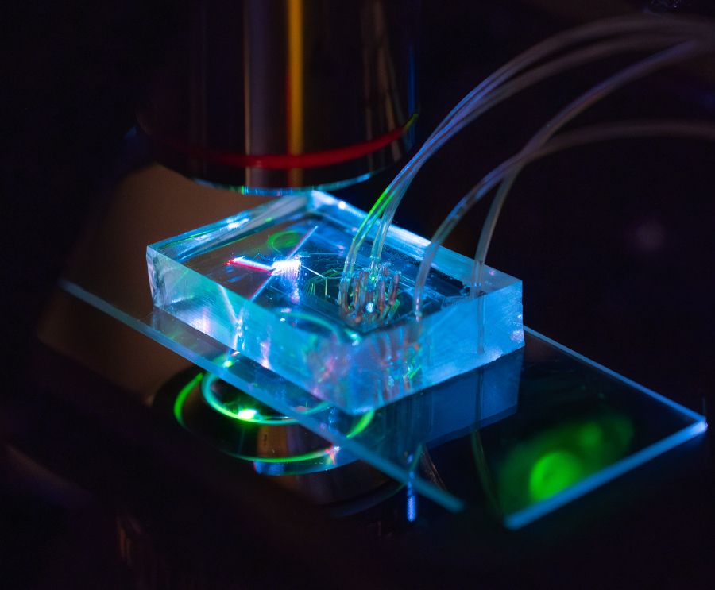

# "Ritmos": Real-time Technology for Microfluidic Droplet Sorting  

Welcome to the main repository where we maintain the different documentation parts of the open source hardware flow-cytometer for Fluorescence Activated Droplet Sorting (FADS). The overaching aim of this project is to *open up* microfluidic experimentation, by creating a prototype instrument that is based on *connectable*, *open source hardware*, modern and *low-cost* components (such as RaspberryPi, RedPitaya. Adrunio, 3D printing, on-board components, open or at least accessible design software and operation software especially python). A key design element for this purpose is that the hardware and sorftware design is *easy to understand and modify for most interested scientists*, in contrast to many efforts in current Open Source FPGA development, which need substantive developer expertise. Currently, similar solutions in the lab come either in a "black-box instrument" as a commercial closed-source and non-modyfiable solution, or are assembled by scientists based on National Instruments FPGA cards with user-friendly yet obscure, expensive and closed-source LabView software libraries. Both solutions are not satisfying for the budget or modifyability of most academic labs in the world. Note that the design in this repository is quite different to literatures designs. The set-up has been designed to significantly lower cost (estimated parts cost 20-30k USD, mainly for optical filters, detectors and laser) and open source it, including hardware, software and accessible fabrication of parts where possible. Also, a number of updates and improvements have been made over the current state-of the art of droplet sorters, inspired by technical advances in the related field of flow-cytometry.

Follow us! [#twitter](https://twitter.com/WenzelLab), [#YouTube](https://www.youtube.com/@librehub), [#LinkedIn](https://www.linkedin.com/company/92802424), [#instagram](https://www.instagram.com/wenzellab/), [#Printables](https://www.printables.com/@WenzelLab), [#LIBREhub website](https://librehub.github.io), [#IIBM website](https://ingenieriabiologicaymedica.uc.cl/en/people/faculty/821-tobias-wenzel)

## Components of this project

* FPGA-powered and Python-based open source workstation controller [RITMO Conductor](https://github.com/wenzel-lab/droplet-sorting-FPGA-controller/tree/master), built on a stripped-down version of [PyRPL](https://github.com/wenzel-lab/pyrpl), designed to run on a Red Pitaya single board computer.

* [Graphical User Interface (GUI)](https://github.com/wenzel-lab/droplet-sorter-GUI) of the droplet sorter, designed with Bokeh (Python) to run on an independent computer. It uncludes a WebSocket webserver that communicates with the RedPitaya board.

* [Robotic positioning stage](https://github.com/wenzel-lab/squid-motorized-stage) for microfluidic sorting chips, with it's own [stage controller software](https://github.com/wenzel-lab/droplet-sorter-stage-software), of course written in python. The optoelectronic assembly is highly based on digital fabriaction, especially 3d printing, to increase accessibility and modifiability.

* [Custom multiplexer board](https://github.com/wenzel-lab/droplet-sorter-master/tree/main/multiplexer-board) to expand the two fast analogue detector inputs of the RedPitaya computer to six channels by multiplexing, as well as communication with the pulse generation board and detector bias voltages.

* [High voltage sorting pulse generation board](https://github.com/wenzel-lab/high-voltage-pulse-generator/)

* [Open source microfluidic flow controller](https://github.com/wenzel-lab/modular-microfluidics-workstation-controller)
  

## Background - sorting of microfluidic droplets

If you are wondering what the sorting of microfluidic droplets is, we reccomend the following litertature:
* The original [droplet sorting publication (2009)](https://doi.org/10.1039/b902504a) using electrical droplet actuacion and fluorescence detection.
* A review of [active droplet sorting methods (2017)](https://doi.org/10.1039/c6lc01435f ), inclduing alternatives to the dielectrophoresis used here.
* A review of [advances on sorting and detection methods (2021)](https://doi.org/10.3389/fchem.2021.666867) in the context of directed enzyme evolution.
* And a [detailed protocol (2023)](https://doi.org/10.1038/s41596-022-00796-2) of how to assemble a current state-of-the-art droplet sorting set-up with propriatory parts and LabView, similar to the set-ups that exsist in several research labs around the world (estimated parts costs 200.000 USD).
* Since recently, there are also commercial solutions available (for a significantly higher cost and non-modyfiable, but convenient to buy and use), especially the [Styx](https://atrandi.com/styx), [Pico-Mine](https://spherefluidics.com/our-products/platform-products/cyto-mine/), [On-Chip Sort](https://on-chipbio.com/#link02).

## Preview of the components 

Our current sorter implementation uses a [custom multiplexer board](https://github.com/wenzel-lab/droplet-sorter-master/tree/main/multiplexer-board) to expand the two fast analogue imputs (for the use of two detectors) of the RedPitaya computer and FPG board to the use of six channels by multiplexing one of the analoguse imputs. The board also replicates the pins of the RedPitaya board for additional interfaces, for example with our pulse generator (see below) and the bias voltage control of the detectors. A future version implementation of the sorting controll is the making, where we use the RedPitaya X-channel system to add pairs of analogue inputs (and therefore detector inputs) to the capability of the stack, which is faster and more expandable.

Our robotic positioning stage. In the image on the right, you can see in blue all the pieces in the assembly that are 3d printed.

And our otptical detection arm assembly is based on the [Open-UC2 3d printed optics cubes](https://github.com/openUC2/UC2-GIT). The modified and new Open-UC2 compatible cubes can be found in the STL folder of this repository, and all modifyable design files are openly availble in the cloud [here on OnShape](https://tinyurl.com/WenzelLabUC2), where you can view, export and copy (to modify) the project designs.

Droplets are moved using our [microfluidics controller](https://github.com/wenzel-lab/modular-microfluidics-workstation-controller)

## Commercial and OEM components

For our implementation, we use a [compact OEM low-noise 3-laser module with eliptical beam forming](https://github.com/wenzel-lab/droplet-sorter-master/blob/main/docs/Laser_spec_PEC-410%20800049%20LRBV-FS-118%20Specification%20V01%20211012.pdf), to illuminate the sorting channel from above, so that we can also detect a lable-free side scattering signal in the detection arm.

We use the [MER2-160-227U3M-L camera](https://github.com/wenzel-lab/droplet-sorter-master/blob/main/docs/MER2-160-227U3MC(-L)-Datasheet%20mono%20high%20speed.pdf), a compact monochrome USB3 camera with the Sony IMX273 CMOS sensor, for fast framerate and triggering for strobe-illumination.

We also use modern [SiPM detectors from KETEK](https://github.com/wenzel-lab/droplet-sorter-master/blob/main/docs/KETEK-PE3315-WL-TIA-SP.pdf) that are both lower in cost and higher in performance compared to traditionally used PMT modules (lower dark noise, broader sensitive range, and they don't break when illuminated accidentally), but unfortunately the producer KETEK was recently purchased by Broadcom and they have discontinued this line of products, which means that currently more expensive competitor producs (be it PMTs, SiPMs or APDs) have to be used for new implementations of the sorter. In the end, the detector module types makes no difference for the assembly of the sorter, because it is agnostic to what module passes the voltage signal to the FPGA-board inputs.

## Optical filters used:

Please [handle optical filters with care](https://github.com/wenzel-lab/droplet-sorter-master/blob/main/docs/Handling%20of%20optical%20filters.pdf)!

| Filter | Type | supplier |
| :---   | :---  | :--- |
| FF01-561/14-25   | Bandpass filter to clean Lime-LED spectrum  | [AHF](https://ahf.de/produkte/spektralanalytik-photonik/optische-filter/einzelfilter/bandpass-filter/500-599-nm/561-14-brightline-hc/F39-563)    |
| ZET405/488/640m     | Tri-band filter to only block laser lines from camera | [Chroma](https://www.chroma.com/products/parts/zet405-488-640m)    |
| Di03-R405/488/561/635-t1-25x36   | 4-band beamsplitter to seperate scattering from fluorescence | [Laser2000](Di03-R405/488/561/635-t1-25x36)    |
| FF02-482/18-25   | Bandpass for 488nm laser scattering detection   | [AHF](https://ahf.de/produkte/spektralanalytik-photonik/optische-filter/einzelfilter/bandpass-filter/400-499-nm/482-18-brightline-hc/F39-483)    |
| glass slide     | to couple 4% reflected blue LED light into the beampath for alignment     | none    |
| FF01-446/523/600/677-25 | 4-band blocking filter for all fluorescence channels | [AHF](https://ahf.de/produkte/spektralanalytik-photonik/optische-filter/einzelfilter/bandpass-filter/multiband-filter/446-523-600-677-hc-quadband-filter/F72-866)    |
| FF555-Di03-25x36    | Central dichroic beam splitter between fluorescence channels | [AHF](https://ahf.de/produkte/spektralanalytik-photonik/optische-filter/strahlenteiler/epi-fluoreszenz-strahlenteiler/standard-strahlenteiler/langpass/strahlenteiler-hc-555/F38-555)    |
| FF495-Di03-25x36   | dichroic beam splitter to seperate blue and green fluorescence   | [AHF](https://ahf.de/produkte/spektralanalytik-photonik/optische-filter/strahlenteiler/epi-fluoreszenz-strahlenteiler/standard-strahlenteiler/langpass/strahlenteiler-hc-495/F38-495)    |
| T640LPXR   | dichroic beam splitter to seperate red and orange fluorescence      | [AHF](https://ahf.de/produkte/spektralanalytik-photonik/optische-filter/strahlenteiler/epi-fluoreszenz-strahlenteiler/standard-strahlenteiler/langpass/strahlenteiler-t-640-lpxr/F48-642)    |
| FF01-445/20-25   | bandpass filter blue    | [AHF](https://ahf.de/produkte/spektralanalytik-photonik/optische-filter/einzelfilter/bandpass-filter/400-499-nm/445-20-brightline-hc/F39-445)    |
| FF01-525/30-25   | bandpass filter green    | [AHF](https://ahf.de/produkte/spektralanalytik-photonik/optische-filter/einzelfilter/bandpass-filter/500-599-nm/525-30-brightline-hc/F37-526)    |
| FF01-600/37-25   | bandpass filter orange    | [AHF](https://ahf.de/produkte/spektralanalytik-photonik/optische-filter/einzelfilter/bandpass-filter/600-699-nm/600-37-brightline-hc/F39-637)    |
| FF01-697/58-25   | bandpass filter red     | [AHF](https://ahf.de/produkte/spektralanalytik-photonik/optische-filter/einzelfilter/bandpass-filter/600-699-nm/697-58-brightline-hc/F37-697)    |

## Contribute

This is an open project in the Wenzel Lab in Santiago, Chile. If you have any suggestions to improve it or add any additional functions make a pull-request or [open an issue](https://github.com/wenzel-lab/droplet-sorter-master/issues/new).
For interactions in our team and with the community applies the [GOSH Code of Conduct](https://openhardware.science/gosh-2017/gosh-code-of-conduct/).

## License

[CERN OHL 2W](LICENSE) © Nicolas Peschke, Matias Hurtado and Tobias Wenzel. This project is Open Source Hardware - please acknowledge us when using the hardware or sharing modifications.
