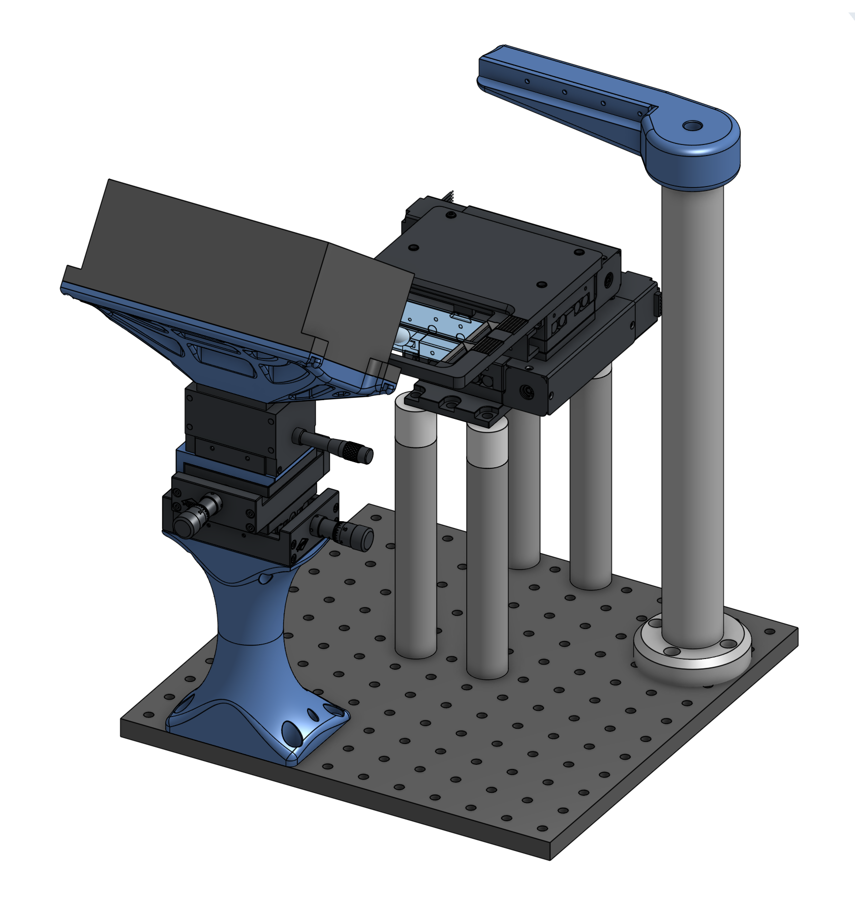
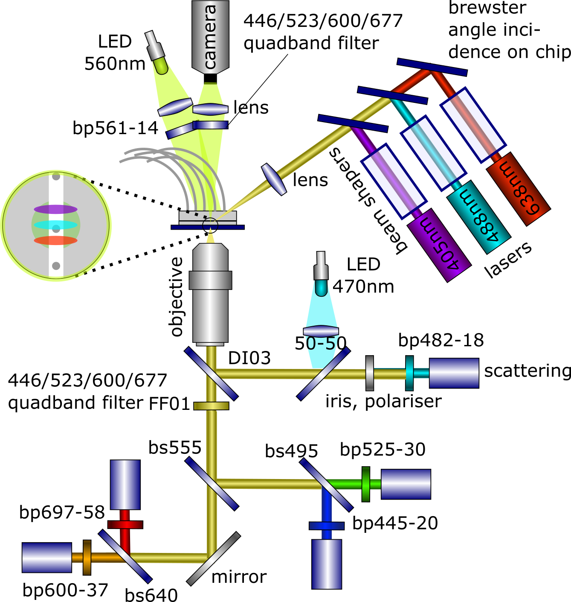
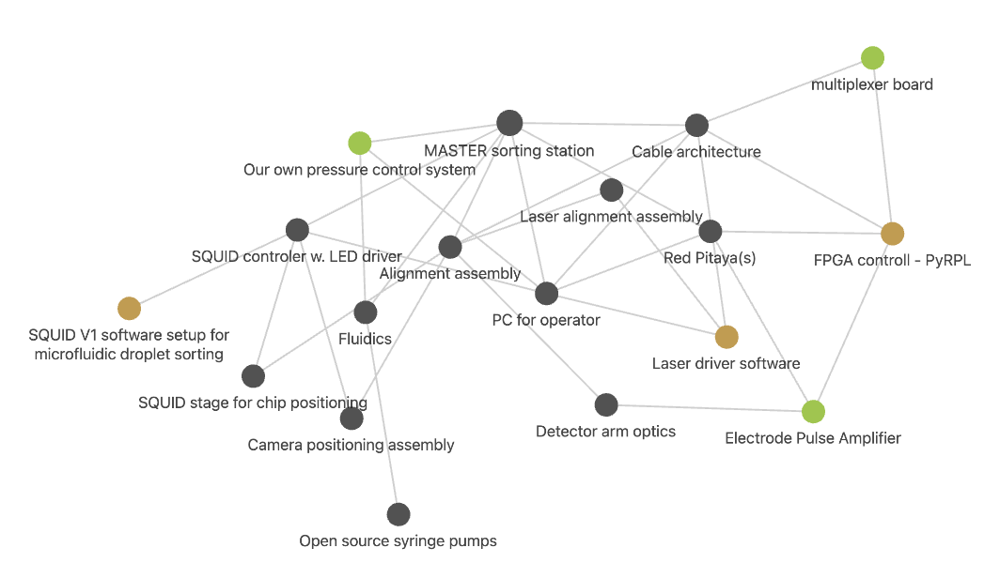

# Master Repository of the Open Hardware Design of the Fluorescence Activated (Microfluidic) Droplet Sorter (FADS) 
Master repository that documents how the different parts come together of the open source hardware Fluorescence Activated (Microfluidic) Droplet Sorter (FADS). Note that the design in this repository is quite different to literatures designs. The set-up has been designed in order to make it more low-cost (estimated parts cost 20k USD, mainly for optical filters, detectors and laser) and open source, including hardware, software and accessible fabrication of parts where possible. Also, a number of updates and improvements have been made over the current state-of the art of droplet sorters, inspired by technical advances in the related field of flow-cytometry.

Follow us! [#twitter](https://twitter.com/WenzelLab), [#YouTube](https://www.youtube.com/@librehub), [#LinkedIn](https://www.linkedin.com/company/92802424), [#instagram](https://www.instagram.com/wenzellab/), [#Printables](https://www.printables.com/@WenzelLab), [#LIBREhub website](https://librehub.github.io), [#IIBM website](https://ingenieriabiologicaymedica.uc.cl/en/people/faculty/821-tobias-wenzel)

## Background

### Sorting of microfluidic droplets

If you are wondering what the sorting of microfluidic droplets is, we reccomend the following litertature:
* The original [droplet sorting publication (2009)](https://doi.org/10.1039/b902504a) using electrical droplet actuacion and fluorescence detection.
* A review of [active droplet sorting methods (2017)](https://doi.org/10.1039/c6lc01435f ), inclduing alternatives to the dielectrophoresis used here.
* A review of [advances on sorting and detection methods (2021)](https://doi.org/10.3389/fchem.2021.666867) in the context of directed enzyme evolution.
* And a [detailed protocol (2023)](https://doi.org/10.1038/s41596-022-00796-2) of how to assemble a current state-of-the-art droplet sorting set-up as it exsists in several research labs around the world (estimated parts costs 200.000 USD).
* Since recently, there are also commercial solutions evailable (even more expensive and non-modyfiable, but off the shelf), especially the [Styx](https://atrandi.com/styx), [Pico-Mine](https://spherefluidics.com/our-products/platform-products/cyto-mine/), [On-Chip Sort](https://on-chipbio.com/#link02), 

### Approach and platform choice

The overaching aim of this project is to *open up* microfluidic experimentation, by creating a prototype instrument that is based on *connectable*, *open source hardware*, modern and *low-cost* components (such as RasberriPi, Adrunio, 3D printing, on-board components, open or at least accessible design software and operation software especially python). A key design element for this purpose is that the hardware and sorftware design is *easy to understand and modify for most interested scientists*, in contrast to many efforts in current Open Source FPGA development, which need substantive developer expertise. Currently, similar solutions in the lab come either in a "black-box instrument" as a commercial closed-source and non-modyfiable solution, or are assembled by scientists based on National Instruments FPGA cards with user-friendly yet obscure, expensive and closed-source LabView software libraries. Both solutions are not satisfying for the budget or modifyability of most academic labs in the world.

## Repositories of this project

* Our [open source FPGA controll](https://github.com/wenzel-lab/droplet-sorting-FPGA-controller/tree/master)
* The microfluidic chip is positioned with an [open source SQUID microscopy stage](https://github.com/wenzel-lab/squid-motorized-stage).

  
* And our [otptical detection arm assembly](https://github.com/wenzel-lab/droplet-cytometry-optomechanics/tree/main) is based on the [Open-UC2 3d printed optics cubes](https://github.com/openUC2/UC2-GIT). The modified and new Open-UC2 compatible cubes can be found in the STL folder of this repository, and all modifyable design files are openly availble in the cloud [here on OnShape](https://tinyurl.com/WenzelLabUC2), where you can view, export and copy (to modify) the project designs.

* Droplets are moved using our [microfludidics controller](https://github.com/wenzel-lab/modular-microfluidics-workstation-controller)

* The project has many other components, some of which are not yet documented:

## Contribute

This is an open project in the Wenzel Lab in Santiago, Chile. If you have any suggestions to improve it or add any additional functions make a pull-request or [open an issue](https://github.com/wenzel-lab/droplet-sorter-master/issues/new).
For interactions in our team and with the community applies the [GOSH Code of Conduct](https://openhardware.science/gosh-2017/gosh-code-of-conduct/).

## License

[CERN OHL 2W](LICENSE) © Nicolas Peschke and Tobias Wenzel. This project is Open Source Hardware - please acknowledge us when using the hardware or sharing modifications.
